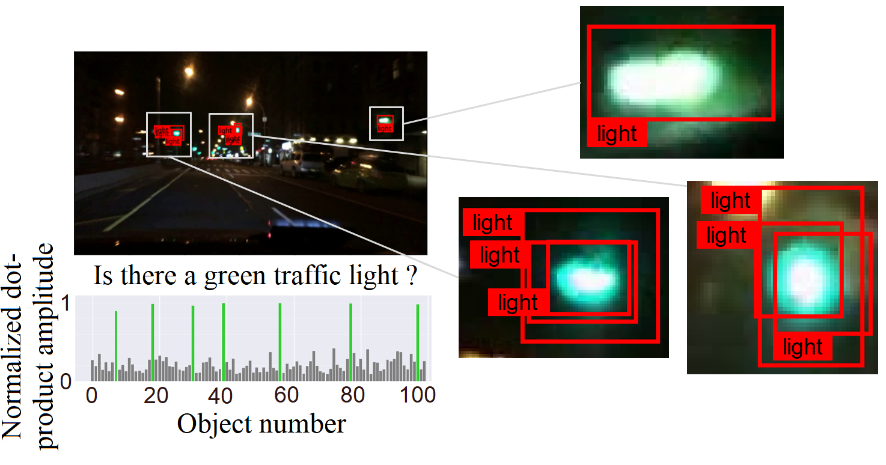

# Scene Understanding for Autonomous Driving Using Visual Question Answering

This repository is an official implementation of the paper [Scene Understanding for Autonomous Driving Using Visual Question Answering](https://ieeexplore.ieee.org/document/10191714).  
In this work, the visual question-answering (VQA) technique is applied to check the correctness of scene understanding.
We build a new dataset by extending BDD100K with annotations from 4000 factual answers and improve answering performance by modifying [a Transformer-based cross-modal model](https://arxiv.org/abs/1908.07490). 
Furthermore, we extract cross-attention heatmaps and show a remarkable correlation between the input question and the visual elements in the image.

<p align="center">


</p>

## Table of contents
- [Model pipeline](#model-pipeline)
- [Getting started](#getting-started)
  - [Folder structure](#folder-structure)
  - [Create a conda environment](#create-a-conda-environment)
  - [Data preparation](#data-preparation)
  - [Feature extraction (option)](#feature-extraction-option)
- [Entry point](#entry-point)
  - [Test](#test)
  - [Training](#training)
- [Citing our work](#citing-our-work)
- [Contributors](#contributors)


## Model pipeline
<p align="center">

</p>

## Getting started
### Folder structure
```sh
|-- input                                      <- You could copy of link the downloaded input folder here
|   |-- checkpoints                            <- Pretraining weights and model checkpoints
|   |   |-- Weights_modified.pth               <- Pretraining weights of the modified model
|   |   |-- Weights_baseline.pth               <- Pretraining weights of the base model
|   |-- bdd100k_image                          <- Images from the bdd100k video dataset
|   |   |-- train                              <- Training set containing 2500 images
|   |   |-- val                                <- Validation set containing 500 images
|   |   |-- test                               <- Testing set containing 1000 images
|   |   |-- test_heatmap                       <- 100 images from the testing set for heatmap visualization
|   |-- annotation                             <- Various labels based on different sets and requirements
|   |   |-- questionset.json                   <- Questions dataset, including questions about red light, green light, and road signs, with three different questions for each type.
|   |   |-- trainlabels.json                   <- Ground truth labels for six questions corresponding to each image in the training set.
|   |   |-- vallabels.json                     <- Ground truth labels for six questions corresponding to each image in the validation set.
|   |   |-- testlabels.json                    <- Ground truth labels for six questions corresponding to each image in the testing set.
|   |   |-- testlabels_heatmap.json            <- Ground truth labels for six questions corresponding to each image in the heatmap testing set.
|   |   |-- greenlight.json                    <- Ground truth labels for objects of interest in images related to the green light question in the heatmap testing set.
|   |   |-- redlight.json                      <- Ground truth labels for objects of interest in images related to the red light question in the heatmap testing set.
|   |   |-- roadsigns.json                     <- Ground truth labels for objects of interest in images related to the road signs question in the heatmap testing set.
|   |-- extracted_features                     <- Extracted features from images, saved as .npy files
|   |   |-- train                              <- Extracted features from training set images
|   |   |-- val                                <- Extracted features from validation set images
|   |   |-- test                               <- Extracted features from testing set images
|
|-- output                                     <- Outputs of project
|
|-- src
|   |-- lxrt/
|   |   |-- entry.py                           <- Entry point for connecting modules.
|   |   |-- file_utils.py                      <- Utility for processing input features, configuring the model, and loading pre-trained weights.
|   |   |-- modeling_base.py                   <- Baseline modeling for LXMERT.
|   |   |-- modeling_modified.py               <- Modified modeling for LXMERT.
|   |   |-- optimization.py                    <- Definition of custom optimizer.
|   |   |-- tokenization.py                    <- Tokenization classes.
|   |-- utils/
|   |   |-- logger.py                          <- Setup for logging.
|   |   |-- param.py                           <- Definition of project parameters.
|   |   |-- utils.py                           <- Utility functions for formatting documents.
|-- dataset.py                                 <- Custom data loading for the project.
|-- model.py                                   <- Building the LXMERT model.
|-- optimizer.py                               <- Building the pipeline and training process.
|-- heatmap_visualization.py                   <- Visualization of attention scores using heatmaps.
|-- .gitignore                                 <- Files and directories to be ignored by Git.
|-- main.py                                    <- Main entry point for the project.
|-- README.md                                  <- Readme file with project documentation.
|-- requirements.txt                           <- List of required Python packages.
```

### Create a conda environment
To ensure a smooth setup and avoid environment conflicts, please follow the steps below to create a clean environment for your project.
```sh
conda env create --name VQA_env
conda activate VQA_env
conda install -r requirements.txt
```
### Data preparation
To obtain the input data required for training the model, please download the dataset using the following link: [download dataset](https://download.fortiss.org/public/20230921_KIW_VQA/KIW_VQA_Input.zip).  
You can copy or create a link to this downloaded folder, following the folder structure provided above. This will prepare everything needed for training and testing, including intermediate image features. You can proceed directly to step 10 without having to go through the process of annotating the image question answers and generating intermediate image features.

The dataset is structured as follows:  
We initially select a subset of the [Berkeley Deep Drive (BDD100k) dataset](https://doc.bdd100k.com/download.html), which includes 2,000 videos, as the foundation for our custom dataset.  
This subset is further divided into three distinct splits:
- 1,250 video samples for the main training dataset.
- 250 video samples for the validation dataset.
- 500 video samples for the test dataset.  

For each video, two frames were randomly selected, and each frame was labeled with each question type. The labels were chosen from a binary set {0, 1}.  

Eventually, we have:
- A training set comprising 2,500 images.
- A validation set comprising 500 images.
- A test set comprising 1,000 images.  

Please make sure to download and organize the dataset according to your project's requirements. You can refer to the provided download link for access to the dataset.

### Feature extraction (option)
In this project, the image features are initially generated using  [Mask-RCNN feature extractors](https://github.com/matterport/Mask_RCNN) and [MMF](https://github.com/facebookresearch/mmf). However, due to compatibility issues arising from the use of an older version of Mask-RCNN, conflicts with PyTorch may occur. As a result, we recommend using [Detectron2](https://github.com/facebookresearch/detectron2) as the preferred feature extractor for improved compatibility and performance.

## Entry point
### Test
To run a quick test and generate heatmap visualization, use the following command:
```sh
python main.py --test --load input/checkpoints/Weights_modified --epochs 1 --saveHeatmap
```
These commands allow you to evaluate the model's performance, and the option `--saveHeatmap` is used for scene explanation. We randomly extract 100 images from the test set, manually label the bounding boxes, and generate heatmaps for visualization. Then the generated images will be saved in output folder.
### Training 

Instead of training the model from scratch, we utilize pretrained weights from the LXMERT model. To fine-tune the LXMERT model using the Berkeley Deep Drive-X (eXplanation) Dataset as a baseline, we provide two pretrained weight options: one for the baseline LXMERT model and another for the modified LXMERT model.  
To fine-tune the baseline LXMERT model, use the following command:
```sh
python main.py --train --baseline --load ./input/checkpoints/Weights_baseline
```

To fine-tune the modified LXMERT model, use the following command:
```sh
python main.py --train --load ./input/checkpoints/Weights_modified 
```
You can customize training parameters using command line arguments. For example:
- To change the batch size to 8, use `--batchSize 8`.
- To change the epochs to 20, use `--epochs 20`.  

For details of command line arguments. see [param.py](./src/utils/param.py).   
The fine-tuned weights will be saved at `output`.

## Citing our work
If you find our work useful in your research, please consider citing:
```bibtex
@inproceedings{wantiez2023scene,
  title={Scene Understanding for Autonomous Driving Using Visual Question Answering},
  author={Wantiez, Adrien and Qiu, Tianming and Matthes, Stefan and Shen, Hao},
  booktitle={2023 International Joint Conference on Neural Networks (IJCNN)},
  pages={1--7},
  year={2023},
  organization={IEEE}
}
```

## Contributors
We would like to acknowledge and express our gratitude to the following individuals who have also contributed to this project:
- [Zihan Xu](https://github.com/xzhxzhxzhxzhxzh) - Contributed to code improvements.
- [Xin Gu](https://github.com/xingggu) - Contributed to dataset preparation, code enhancements and documentations.  

Their valuable contributions have been instrumental in the success and improvement of this project. Thank you for your dedication and hard work!
